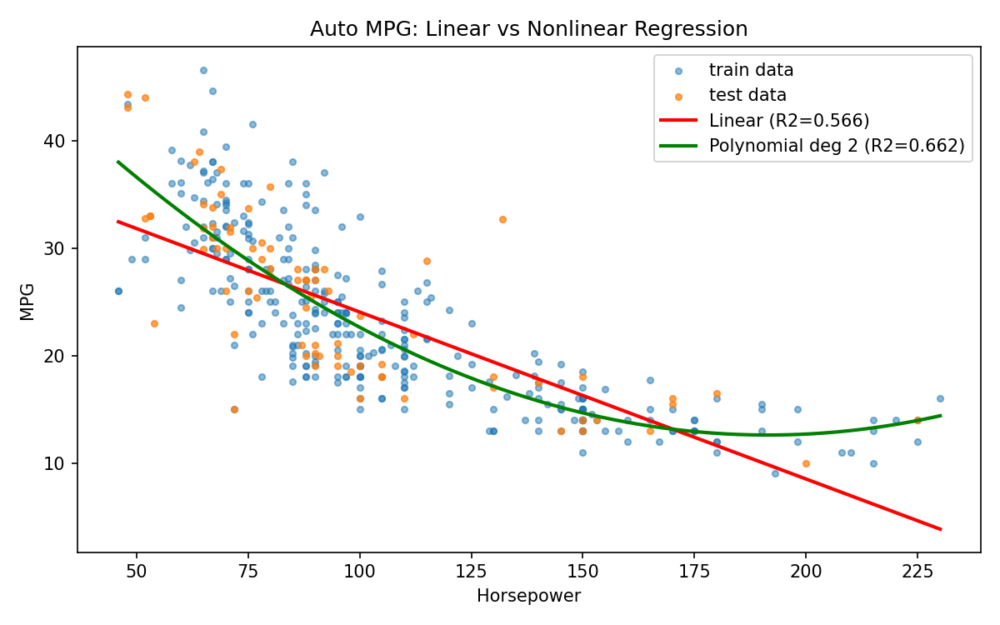
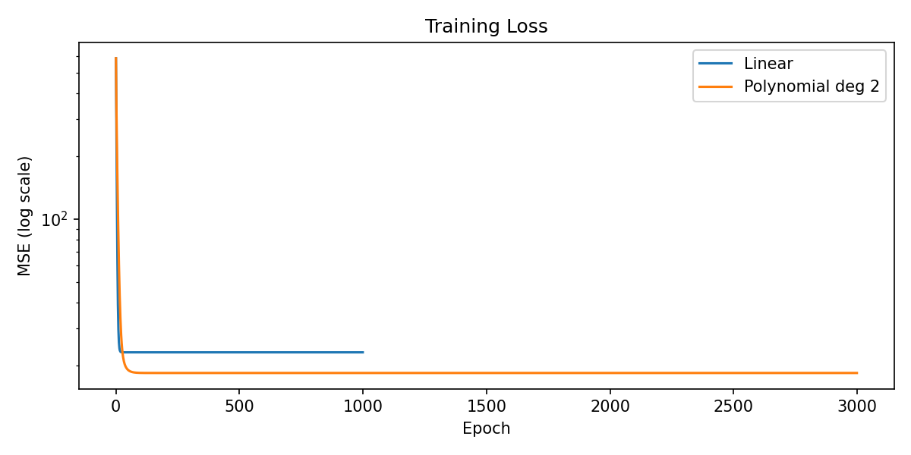

# 선형회귀와 비선형회귀 프로그래밍 실습

데이터처리개론 과제 — 공개 데이터(UCI Auto MPG)로 자동차의 **마력(horsepower)** 에서 **연비(mpg)** 를 예측하는 선형회귀·비선형회귀 프로그램입니다.

## 모델
| 모델 | 식 | 학습 방법 |
|---|---|---|
| 선형회귀 | y = w·x + b | 경사하강법 (numpy 직접 구현) |
| 비선형회귀 | y = w₂·x² + w₁·x + b | 경사하강법 (numpy 직접 구현) |

## 실행 방법
```bash
pip install -r requirements.txt
python regression.py
```
Google Colab에서는 `regression.py` 내용을 셀에 붙여넣고 실행하면 됩니다.

## 결과



## 데이터 출처
Quinlan, R. (1993). Auto MPG [Dataset]. UCI Machine Learning Repository.
